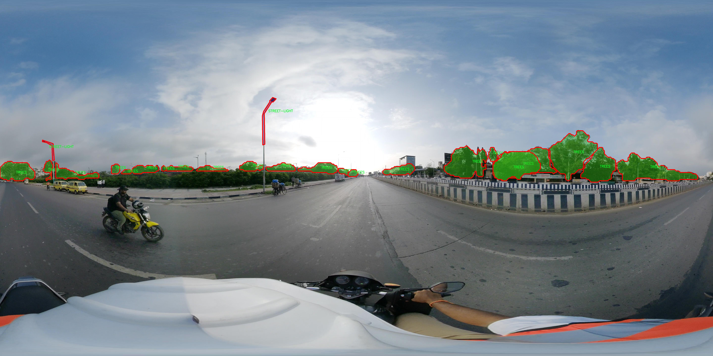

# 自动驾驶场景城市交通设施分割系统： yolov8-seg-vanillanet

### 1.研究背景与意义

[参考博客](https://gitee.com/YOLOv8_YOLOv11_Segmentation_Studio/projects)

[博客来源](https://kdocs.cn/l/cszuIiCKVNis)

研究背景与意义

随着城市化进程的加速，城市交通设施的管理与维护面临着前所未有的挑战。交通设施不仅是城市交通系统的重要组成部分，更是保障交通安全和提高通行效率的关键因素。近年来，自动驾驶技术的迅猛发展为城市交通管理提供了新的解决方案，尤其是在交通设施的自动识别与分割方面，具有重要的研究价值和应用前景。基于此，构建一个高效的自动驾驶场景城市交通设施分割系统显得尤为重要。

在这一背景下，YOLO（You Only Look Once）系列模型因其高效的实时目标检测能力而受到广泛关注。YOLOv8作为该系列的最新版本，结合了深度学习的最新进展，具有更强的特征提取能力和更快的处理速度。然而，传统的YOLOv8模型在复杂城市环境下的交通设施分割任务中仍存在一定的局限性，尤其是在对不同类别交通设施的精确识别和分割上。因此，改进YOLOv8模型以适应城市交通设施的特定需求，将为提升自动驾驶系统的智能化水平提供有力支持。

本研究将基于UNI_360数据集进行模型的训练与测试。该数据集包含1100幅图像，涵盖25个不同类别的交通设施，包括公交站、交通信号灯、行人过街设施等。这些类别的多样性不仅反映了城市交通设施的复杂性，也为模型的训练提供了丰富的样本数据。通过对这些交通设施的实例分割，研究旨在实现对城市交通环境的全面理解，从而为自动驾驶系统提供精准的环境感知能力。

在实际应用中，交通设施的准确识别与分割对于自动驾驶车辆的决策制定至关重要。通过改进YOLOv8模型，研究将能够提高交通设施的检测精度和分割效果，进而提升自动驾驶系统在复杂城市环境中的安全性和可靠性。此外，研究成果还可为城市交通管理提供数据支持，帮助相关部门更好地进行交通设施的规划与维护。

综上所述，基于改进YOLOv8的自动驾驶场景城市交通设施分割系统的研究，不仅具有重要的理论意义，也具备广泛的实际应用价值。通过深入探讨和解决当前自动驾驶技术在交通设施识别与分割方面的挑战，本研究将为推动智能交通系统的发展贡献力量，为未来的城市交通管理提供创新的解决方案。

### 2.图片演示


注意：本项目提供完整的训练源码数据集和训练教程,由于此博客编辑较早,暂不提供权重文件（best.pt）,需要按照6.训练教程进行训练后实现上图效果。

### 3.视频演示

[3.1 视频演示](https://www.bilibili.com/video/BV1DgmZYMEn7/)

### 4.数据集信息

##### 4.1 数据集类别数＆类别名

nc: 19
names: ['BUS-STOP', 'CAUTIONARY-SIGN', 'CCTV', 'CRACK', 'GANTRY-BOARD', 'HOARDING', 'HOTSPOT', 'INFORMATORY-SIGN', 'MANHOLE', 'METRO-STATION', 'PEDESTRIAN-CROSSING', 'POTHOLE', 'RAVELLING', 'ROAD-PATCH', 'RUMBLING-STRIP', 'SPEED-BREAKER', 'STREET-LIGHT', 'TRAFFIC-LIGHT', 'TREES']


##### 4.2 数据集信息简介

数据集信息展示

在自动驾驶技术的快速发展中，准确的城市交通设施分割系统显得尤为重要。为此，本研究选用了名为“UNI_360”的数据集，旨在改进YOLOv8-seg模型在城市环境中对交通设施的识别与分割能力。该数据集专门针对城市交通场景进行了精心设计，包含了19个不同类别的交通设施，能够为模型提供丰富的训练样本和多样化的场景特征。

“UNI_360”数据集的类别包括：公交站（BUS-STOP）、警告标志（CAUTIONARY-SIGN）、监控摄像头（CCTV）、路面裂缝（CRACK）、跨线桥标牌（GANTRY-BOARD）、围挡（HOARDING）、热点区域（HOTSPOT）、信息标志（INFORMATORY-SIGN）、人孔（MANHOLE）、地铁站（METRO-STATION）、人行横道（PEDESTRIAN-CROSSING）、坑洼（POTHOLE）、路面剥落（RAVELLING）、路面修补（ROAD-PATCH）、减速带（RUMBLING-STRIP）、减速带（SPEED-BREAKER）、路灯（STREET-LIGHT）、交通信号灯（TRAFFIC-LIGHT）以及树木（TREES）。这些类别涵盖了城市交通中常见的设施与障碍物，为模型的训练提供了全面的基础。

在数据集的构建过程中，研究团队采用了高精度的图像采集技术，确保每个类别的样本在不同光照、天气和视角下均有良好的表现。这种多样性不仅增强了模型的鲁棒性，还提高了其在实际应用中的适应能力。此外，数据集中的每个样本都经过精细的标注，确保了训练过程中使用的数据的准确性和可靠性。这对于YOLOv8-seg模型的学习至关重要，因为模型的性能直接依赖于训练数据的质量。

通过使用“UNI_360”数据集，研究团队能够有效地训练YOLOv8-seg模型，使其在城市交通场景中对各类设施进行精准的分割与识别。这一过程不仅有助于提升自动驾驶系统的环境感知能力，还为后续的决策制定提供了重要的基础数据支持。随着自动驾驶技术的不断进步，准确的交通设施识别将为城市交通管理、智能导航和安全驾驶提供更为可靠的保障。

综上所述，“UNI_360”数据集在自动驾驶领域的应用潜力巨大。它不仅为模型的训练提供了丰富的样本和多样化的场景，还通过精细的标注和高质量的数据采集，确保了模型学习的有效性。未来，随着数据集的不断扩展和更新，自动驾驶技术将能够在更复杂的城市环境中实现更高水平的智能化和自动化，为人们的出行安全和便利性做出更大的贡献。





### 5.项目依赖环境部署教程（零基础手把手教学）

[5.1 环境部署教程链接（零基础手把手教学）](https://www.bilibili.com/video/BV1jG4Ve4E9t/?vd_source=bc9aec86d164b67a7004b996143742dc)


[5.2 安装Python虚拟环境创建和依赖库安装视频教程链接（零基础手把手教学）](https://www.bilibili.com/video/BV1nA4VeYEze/?vd_source=bc9aec86d164b67a7004b996143742dc)

### 6.手把手YOLOV8-seg训练视频教程（零基础手把手教学）

[6.1 手把手YOLOV8-seg训练视频教程（零基础小白有手就能学会）](https://www.bilibili.com/video/BV1cA4VeYETe/?vd_source=bc9aec86d164b67a7004b996143742dc)


按照上面的训练视频教程链接加载项目提供的数据集，运行train.py即可开始训练



     Epoch   gpu_mem       box       obj       cls    labels  img_size
     1/200     0G   0.01576   0.01955  0.007536        22      1280: 100%|██████████| 849/849 [14:42<00:00,  1.04s/it]
               Class     Images     Labels          P          R     mAP@.5 mAP@.5:.95: 100%|██████████| 213/213 [01:14<00:00,  2.87it/s]
                 all       3395      17314      0.994      0.957      0.0957      0.0843

     Epoch   gpu_mem       box       obj       cls    labels  img_size
     2/200     0G   0.01578   0.01923  0.007006        22      1280: 100%|██████████| 849/849 [14:44<00:00,  1.04s/it]
               Class     Images     Labels          P          R     mAP@.5 mAP@.5:.95: 100%|██████████| 213/213 [01:12<00:00,  2.95it/s]
                 all       3395      17314      0.996      0.956      0.0957      0.0845

     Epoch   gpu_mem       box       obj       cls    labels  img_size
     3/200     0G   0.01561    0.0191  0.006895        27      1280: 100%|██████████| 849/849 [10:56<00:00,  1.29it/s]
               Class     Images     Labels          P          R     mAP@.5 mAP@.5:.95: 100%|███████   | 187/213 [00:52<00:00,  4.04it/s]
                 all       3395      17314      0.996      0.957      0.0957      0.0845


### 7.50+种全套YOLOV8-seg创新点加载调参实验视频教程（一键加载写好的改进模型的配置文件）

[7.1 50+种全套YOLOV8-seg创新点加载调参实验视频教程（一键加载写好的改进模型的配置文件）](https://www.bilibili.com/video/BV1Hw4VePEXv/?vd_source=bc9aec86d164b67a7004b996143742dc)

### YOLOV8-seg算法简介

原始YOLOv8-seg算法原理

YOLOv8-seg算法是YOLO系列目标检测算法的最新发展，继承了YOLOv5和YOLOv7的优良特性，并在此基础上进行了多项创新和改进。作为一种一阶段目标检测算法，YOLOv8-seg将目标检测与实例分割任务相结合，旨在实现高效且准确的目标识别与分割，尤其适用于复杂场景下的实时应用。

YOLOv8-seg的核心在于其网络结构的设计，该结构由主干网络（backbone）、特征增强网络（neck）和解耦检测头（head）三部分组成。主干网络采用了CSPDarknet的思想，进一步优化了特征提取的效率和准确性。YOLOv8-seg在主干网络中引入了C2f模块，这一模块通过多分支结构有效增强了梯度流动，缓解了深层网络中的梯度消失问题。C2f模块的设计灵感来源于YOLOv5的C3模块与YOLOv7的ELAN思想，允许在特征提取过程中实现更丰富的特征融合，从而提升了模型的表达能力。

在特征增强网络方面，YOLOv8-seg采用了PAN-FPN结构，这一结构通过自下而上的特征融合与自上而下的特征传递，有效地整合了不同尺度的特征信息。通过这种方式，YOLOv8-seg能够在处理多尺度目标时，保持高效的特征表达能力，确保在复杂场景中实现准确的目标检测与分割。特征增强网络的设计使得模型能够在不同层次上捕捉到目标的细节信息和语义信息，从而提升了检测的精度。

YOLOv8-seg的检测头采用了解耦结构，将目标分类与位置回归任务分开处理。这一创新使得模型在处理复杂场景时，能够更专注于各自的任务，减少了因任务耦合导致的错误。这种解耦设计使得YOLOv8-seg在分类和定位任务上都能实现更高的准确率，尤其是在目标密集或重叠的情况下，能够有效减少误检和漏检现象。

值得一提的是，YOLOv8-seg引入了Anchor-free的目标检测方法，这一方法不再依赖于预定义的锚框，而是通过回归直接预测目标的位置和大小。这一转变极大地简化了模型的设计，减少了锚框选择和调整的复杂性，同时也提高了模型对不同尺度和形状目标的适应能力。Anchor-free方法使得YOLOv8-seg能够更快速地聚焦于目标的实际边界，从而提高了检测的效率和准确性。

在损失函数的设计上，YOLOv8-seg采用了多种损失函数的组合，包括VFLLoss、DFLLoss和CIoULoss。这些损失函数的设计旨在解决样本不平衡问题，并增强模型对困难样本的学习能力。VFLLoss通过对正负样本进行不对称加权，使得模型能够更关注高质量的正样本，从而提升检测精度。DFLLoss和CIoULoss则分别用于回归损失的计算，确保模型在位置预测上的准确性。

在数据预处理方面，YOLOv8-seg延续了YOLOv5的策略，采用了马赛克增强、混合增强、空间扰动和颜色扰动等多种数据增强手段。这些增强策略有效提升了模型的鲁棒性，使其在面对不同场景和光照条件时，依然能够保持较高的检测性能。

综上所述，YOLOv8-seg算法通过多项创新和改进，结合了目标检测与实例分割的优势，展现出在实时目标检测与分割任务中的卓越性能。其高效的网络结构、灵活的Anchor-free设计、解耦的检测头以及先进的损失函数，使得YOLOv8-seg在复杂场景下的目标识别与分割任务中，具备了更强的适应性和准确性。这一算法的提出，不仅为目标检测领域带来了新的思路，也为实际应用提供了更为高效的解决方案。


### 9.系统功能展示（检测对象为举例，实际内容以本项目数据集为准）

图9.1.系统支持检测结果表格显示

  图9.2.系统支持置信度和IOU阈值手动调节

  图9.3.系统支持自定义加载权重文件best.pt(需要你通过步骤5中训练获得)

  图9.4.系统支持摄像头实时识别

  图9.5.系统支持图片识别

  图9.6.系统支持视频识别

  图9.7.系统支持识别结果文件自动保存

  图9.8.系统支持Excel导出检测结果数据


### 10.50+种全套YOLOV8-seg创新点原理讲解（非科班也可以轻松写刊发刊，V11版本正在科研待更新）

#### 10.1 由于篇幅限制，每个创新点的具体原理讲解就不一一展开，具体见下列网址中的创新点对应子项目的技术原理博客网址【Blog】：


[10.1 50+种全套YOLOV8-seg创新点原理讲解链接](https://gitee.com/qunmasj/good)

#### 10.2 部分改进模块原理讲解(完整的改进原理见上图和技术博客链接)【如果此小节的图加载失败可以通过CSDN或者Github搜索该博客的标题访问原始博客，原始博客图片显示正常】

### YOLOv8简介


由上图可以看出，C2中每个BottlNeck的输入Tensor的通道数channel都只是上一级的0.5倍，因此计算量明显降低。从另一方面讲，梯度流的增加，t也能够明显提升收敛速度和收敛效果。
C2i模块首先以输入tensor(n.c.h.w)经过Conv1层进行split拆分，分成两部分(n,0.5c,h,w)，一部分直接经过n个Bottlenck，另一部分经过每一操作层后都会以(n.0.5c,h,w)的尺寸进行Shortcut，最后通过Conv2层卷积输出。也就是对应n+2的Shortcut(第一层Conv1的分支tensor和split后的tensor为2+n个bottenlenneck)。
#### Neck
YOLOv8的Neck采用了PANet结构，如下图所示。

Backbone最后SPPF模块(Layer9)之后H、W经过32倍下采样，对应地Layer4经过8倍下采样，Layer6经过16倍下采样。输入图片分辨率为640*640，得到Layer4、Layer6、Layer9的分辨率分别为80*80、40*40和20*20。
Layer4、Layer6、Layer9作为PANet结构的输入，经过上采样，通道融合，最终将PANet的三个输出分支送入到Detect head中进行Loss的计算或结果解算。
与FPN(单向，自上而下)不同的是，PANet是一个双向通路网络，引入了自下向上的路径，使得底层信息更容易传递到顶层。
#### Head
Head部分相比Yolov5改动较大，直接将耦合头改为类似Yolo的解耦头结构(Decoupled-Head)，将回归分支和预测分支分离，并针对回归分支使用了Distribution Focal Loss策略中提出的积分形式表示法。之前的目标检测网络将回归坐标作为一个确定性单值进行预测，DFL将坐标转变成一个分布。


### LSKNet的架构
该博客提出的结构层级依次为：

LSK module（大核卷积序列+空间选择机制） < LSK Block （LK Selection + FFN）<LSKNet（N个LSK Block）


#### LSK 模块

LSK Block
LSKNet 是主干网络中的一个可重复堆叠的块（Block），每个LSK Block包括两个残差子块，即大核选择子块（Large Kernel Selection，LK Selection）和前馈网络子块（Feed-forward Network ，FFN），如图8。LK Selection子块根据需要动态地调整网络的感受野，FFN子块用于通道混合和特征细化，由一个全连接层、一个深度卷积、一个 GELU 激活和第二个全连接层组成。

LSK module（LSK 模块，图4）由一个大核卷积序列（large kernel convolutions）和一个空间核选择机制（spatial kernel selection mechanism）组成，被嵌入到了LSK Block 的 LK Selection子块中。

#### Large Kernel Convolutions
因为不同类型的目标对背景信息的需求不同，这就需要模型能够自适应选择不同大小的背景范围。因此，作者通过解耦出一系列具有大卷积核、且不断扩张的Depth-wise 卷积，构建了一个更大感受野的网络。

具体地，假设序列中第i个Depth-wise 卷积核的大小为 ，扩张率为 d，感受野为 ，它们满足以下关系：


卷积核大小和扩张率的增加保证了感受野能够快速增大。此外，我们设置了扩张率的上限，以保证扩张卷积不会引入特征图之间的差距。


Table2的卷积核大小可根据公式（1）和（2）计算，详见下图：


这样设计的好处有两点。首先，能够产生具有多种不同大小感受野的特征，便于后续的核选择；第二，序列解耦比简单的使用一个大型卷积核效果更好。如上图表2所示，解耦操作相对于标准的大型卷积核，有效地将低了模型的参数量。

为了从输入数据  的不同区域获取丰富的背景信息特征，可采用一系列解耦的、不用感受野的Depth-wise 卷积核：


其中，是卷积核为 、扩张率为  的Depth-wise 卷积操作。假设有个解耦的卷积核，每个卷积操作后又要经过一个的卷积层进行空间特征向量的通道融合。


之后，针对不同的目标，可基于获取的多尺度特征，通过下文中的选择机制动态选择合适的卷积核大小。

这一段的意思可以简单理解为：

把一个大的卷积核拆成了几个小的卷积核，比如一个大小为5，扩张率为1的卷积核加上一个大小为7，扩张率为3的卷积核，感受野为23，与一个大小为23，扩张率为1的卷积核的感受野是一样的。因此可用两个小的卷积核替代一个大的卷积核，同理一个大小为29的卷积核也可以用三个小的卷积代替（Table 2），这样可以有效的减少参数，且更灵活。

将输入数据依次通过这些小的卷积核（公式3），并在每个小的卷积核后面接上一个1×1的卷积进行通道融合（公式4）。

#### Spatial Kernel Selection
为了使模型更关注目标在空间上的重点背景信息，作者使用空间选择机制从不同尺度的大卷积核中对特征图进行空间选择。

首先，将来自于不同感受野卷积核的特征进行concate拼接，然后，应用通道级的平均池化和最大池化提取空间关系，其中， 和  是平均池化和最大池化后的空间特征描述符。为了实现不同空间描述符的信息交互，作者利用卷积层将空间池化特征进行拼接，将2个通道的池化特征转换为N个空间注意力特征图，之后，将Sigmoid激活函数应用到每一个空间注意力特征图，可获得每个解耦的大卷积核所对应的独立的空间选择掩膜，又然后，将解耦后的大卷积核序列的特征与对应的空间选择掩膜进行加权处理，并通过卷积层进行融合获得注意力特征 ，最后LSK module的输出可通过输入特征  与注意力特征  的逐元素点成获得，公式对应于结构图上的操作如下：


### 11.项目核心源码讲解（再也不用担心看不懂代码逻辑）

#### 11.1 ultralytics\nn\extra_modules\RFAConv.py

以下是代码中最核心的部分，并对其进行了详细的中文注释：

```python
import torch
import torch.nn as nn
from einops import rearrange

# 定义h_sigmoid激活函数
class h_sigmoid(nn.Module):
    def __init__(self, inplace=True):
        super(h_sigmoid, self).__init__()
        self.relu = nn.ReLU6(inplace=inplace)  # 使用ReLU6作为基础

    def forward(self, x):
        return self.relu(x + 3) / 6  # h_sigmoid的计算公式

# 定义h_swish激活函数
class h_swish(nn.Module):
    def __init__(self, inplace=True):
        super(h_swish, self).__init__()
        self.sigmoid = h_sigmoid(inplace=inplace)  # 使用h_sigmoid作为基础

    def forward(self, x):
        return x * self.sigmoid(x)  # h_swish的计算公式

# 定义RFAConv模块
class RFAConv(nn.Module):
    def __init__(self, in_channel, out_channel, kernel_size, stride=1):
        super().__init__()
        self.kernel_size = kernel_size

        # 权重生成模块
        self.get_weight = nn.Sequential(
            nn.AvgPool2d(kernel_size=kernel_size, padding=kernel_size // 2, stride=stride),
            nn.Conv2d(in_channel, in_channel * (kernel_size ** 2), kernel_size=1, groups=in_channel, bias=False)
        )
        
        # 特征生成模块
        self.generate_feature = nn.Sequential(
            nn.Conv2d(in_channel, in_channel * (kernel_size ** 2), kernel_size=kernel_size, padding=kernel_size // 2, stride=stride, groups=in_channel, bias=False),
            nn.BatchNorm2d(in_channel * (kernel_size ** 2)),
            nn.ReLU()
        )
        
        # 最终卷积层
        self.conv = nn.Conv2d(in_channel, out_channel, kernel_size=kernel_size, stride=kernel_size)

    def forward(self, x):
        b, c = x.shape[0:2]  # 获取批量大小和通道数
        weight = self.get_weight(x)  # 生成权重
        h, w = weight.shape[2:]  # 获取特征图的高和宽
        
        # 对权重进行softmax归一化
        weighted = weight.view(b, c, self.kernel_size ** 2, h, w).softmax(2)
        
        # 生成特征并重塑
        feature = self.generate_feature(x).view(b, c, self.kernel_size ** 2, h, w)
        
        # 加权特征
        weighted_data = feature * weighted
        
        # 重塑数据以适应卷积层
        conv_data = rearrange(weighted_data, 'b c (n1 n2) h w -> b c (h n1) (w n2)', n1=self.kernel_size, n2=self.kernel_size)
        
        return self.conv(conv_data)  # 返回卷积结果

# 定义SE模块（Squeeze-and-Excitation）
class SE(nn.Module):
    def __init__(self, in_channel, ratio=16):
        super(SE, self).__init__()
        self.gap = nn.AdaptiveAvgPool2d((1, 1))  # 全局平均池化
        self.fc = nn.Sequential(
            nn.Linear(in_channel, ratio, bias=False),  # 降维
            nn.ReLU(),
            nn.Linear(ratio, in_channel, bias=False),  # 恢复维度
            nn.Sigmoid()  # 激活函数
        )

    def forward(self, x):
        b, c = x.shape[0:2]  # 获取批量大小和通道数
        y = self.gap(x).view(b, c)  # 全局平均池化并重塑
        y = self.fc(y).view(b, c, 1, 1)  # 通过全连接层
        return y  # 返回通道注意力

# 定义RFCBAMConv模块
class RFCBAMConv(nn.Module):
    def __init__(self, in_channel, out_channel, kernel_size=3, stride=1):
        super().__init__()
        self.kernel_size = kernel_size
        
        # 特征生成模块
        self.generate = nn.Sequential(
            nn.Conv2d(in_channel, in_channel * (kernel_size ** 2), kernel_size, padding=kernel_size // 2, stride=stride, groups=in_channel, bias=False),
            nn.BatchNorm2d(in_channel * (kernel_size ** 2)),
            nn.ReLU()
        )
        
        # 权重生成模块
        self.get_weight = nn.Sequential(nn.Conv2d(2, 1, kernel_size=3, padding=1, bias=False), nn.Sigmoid())
        self.se = SE(in_channel)  # 通道注意力模块

        # 最终卷积层
        self.conv = nn.Conv2d(in_channel, out_channel, kernel_size=kernel_size, stride=kernel_size)

    def forward(self, x):
        b, c = x.shape[0:2]  # 获取批量大小和通道数
        channel_attention = self.se(x)  # 计算通道注意力
        generate_feature = self.generate(x)  # 生成特征

        h, w = generate_feature.shape[2:]  # 获取特征图的高和宽
        generate_feature = generate_feature.view(b, c, self.kernel_size ** 2, h, w)  # 重塑特征
        
        # 重塑以适应卷积层
        generate_feature = rearrange(generate_feature, 'b c (n1 n2) h w -> b c (h n1) (w n2)', n1=self.kernel_size, n2=self.kernel_size)
        
        # 加权特征
        unfold_feature = generate_feature * channel_attention
        
        # 计算最大值和均值特征
        max_feature, _ = torch.max(generate_feature, dim=1, keepdim=True)
        mean_feature = torch.mean(generate_feature, dim=1, keepdim=True)
        
        # 计算接收场注意力
        receptive_field_attention = self.get_weight(torch.cat((max_feature, mean_feature), dim=1))
        
        # 返回卷积结果
        return self.conv(unfold_feature * receptive_field_attention)

# 定义RFCAConv模块
class RFCAConv(nn.Module):
    def __init__(self, inp, oup, kernel_size, stride=1, reduction=32):
        super(RFCAConv, self).__init__()
        self.kernel_size = kernel_size
        
        # 特征生成模块
        self.generate = nn.Sequential(
            nn.Conv2d(inp, inp * (kernel_size ** 2), kernel_size, padding=kernel_size // 2, stride=stride, groups=inp, bias=False),
            nn.BatchNorm2d(inp * (kernel_size ** 2)),
            nn.ReLU()
        )
        
        # 自适应池化
        self.pool_h = nn.AdaptiveAvgPool2d((None, 1))
        self.pool_w = nn.AdaptiveAvgPool2d((1, None))

        mip = max(8, inp // reduction)  # 中间层通道数

        # 通道压缩层
        self.conv1 = nn.Conv2d(inp, mip, kernel_size=1, stride=1, padding=0)
        self.bn1 = nn.BatchNorm2d(mip)
        self.act = h_swish()  # 使用h_swish激活函数
        
        # 通道恢复层
        self.conv_h = nn.Conv2d(mip, inp, kernel_size=1, stride=1, padding=0)
        self.conv_w = nn.Conv2d(mip, inp, kernel_size=1, stride=1, padding=0)
        
        # 最终卷积层
        self.conv = nn.Conv2d(inp, oup, kernel_size, stride=kernel_size)

    def forward(self, x):
        b, c = x.shape[0:2]  # 获取批量大小和通道数
        generate_feature = self.generate(x)  # 生成特征
        h, w = generate_feature.shape[2:]  # 获取特征图的高和宽
        generate_feature = generate_feature.view(b, c, self.kernel_size ** 2, h, w)  # 重塑特征
        
        # 重塑以适应卷积层
        generate_feature = rearrange(generate_feature, 'b c (n1 n2) h w -> b c (h n1) (w n2)', n1=self.kernel_size, n2=self.kernel_size)
        
        # 计算池化特征
        x_h = self.pool_h(generate_feature)
        x_w = self.pool_w(generate_feature).permute(0, 1, 3, 2)

        # 拼接特征
        y = torch.cat([x_h, x_w], dim=2)
        y = self.conv1(y)  # 通道压缩
        y = self.bn1(y)
        y = self.act(y)  # 激活
        
        h, w = generate_feature.shape[2:]  # 获取特征图的高和宽
        x_h, x_w = torch.split(y, [h, w], dim=2)  # 分割特征
        x_w = x_w.permute(0, 1, 3, 2)

        # 计算通道注意力
        a_h = self.conv_h(x_h).sigmoid()
        a_w = self.conv_w(x_w).sigmoid()
        
        return self.conv(generate_feature * a_w * a_h)  # 返回卷积结果
```

以上代码实现了几个核心的卷积模块，分别是 `RFAConv`、`RFCBAMConv` 和 `RFCAConv`，并使用了 `h_sigmoid` 和 `h_swish` 激活函数以及 `SE` 模块来增强特征表达能力。每个模块的前向传播过程都包含了特征生成、权重计算和最终的卷积操作。

该文件实现了一些自定义的卷积模块，主要包括RFAConv、RFCBAMConv和RFCAConv。文件中使用了PyTorch库，主要用于构建深度学习模型。以下是对文件中各个部分的详细说明。

首先，文件导入了必要的库，包括PyTorch的神经网络模块和einops库。einops库用于重排张量的维度，这在处理卷积操作时非常有用。

接下来，定义了两个激活函数类：h_sigmoid和h_swish。h_sigmoid实现了一个带有ReLU6激活的Sigmoid函数，而h_swish则是Swish激活函数的实现，结合了输入和Sigmoid的输出。

RFAConv类是一个自定义的卷积层，它的构造函数接受输入通道数、输出通道数、卷积核大小和步幅作为参数。该类的核心思想是通过生成特征和加权机制来增强卷积操作。具体来说，RFAConv首先通过平均池化和卷积生成权重，然后生成特征并通过softmax进行归一化，最后将加权后的特征重新排列并通过卷积层输出结果。

RFCBAMConv类是另一个自定义卷积层，它结合了通道注意力机制。该类在构造函数中定义了生成特征的卷积层和一个用于计算通道注意力的SE模块。前向传播中，首先计算通道注意力，然后生成特征并进行重排，最后结合通道注意力和生成特征进行卷积操作。

RFCAConv类则是一个更复杂的卷积层，结合了空间注意力机制。该类在构造函数中定义了生成特征的卷积层，并使用自适应平均池化来获取特征的高度和宽度信息。通过将这两个信息拼接后，经过一系列卷积和激活操作，最终得到空间注意力的权重。最后，RFCAConv将生成的特征与空间注意力相乘，并通过卷积层输出结果。

整体来看，这个文件中的模块通过引入不同的注意力机制和特征生成策略，旨在提升卷积神经网络的性能，尤其是在处理复杂图像任务时。每个模块都采用了较为灵活的设计，允许在不同的网络架构中进行组合和应用。

#### 11.2 ultralytics\nn\extra_modules\head.py

以下是代码中最核心的部分，并附上详细的中文注释：

```python
import torch
import torch.nn as nn
from ultralytics.utils.tal import dist2bbox, make_anchors

class Detect_DyHead(nn.Module):
    """YOLOv8 检测头，使用 DyHead 进行目标检测。"""
    
    def __init__(self, nc=80, hidc=256, block_num=2, ch=()):
        super().__init__()
        self.nc = nc  # 类别数量
        self.nl = len(ch)  # 检测层的数量
        self.reg_max = 16  # DFL 通道数
        self.no = nc + self.reg_max * 4  # 每个锚点的输出数量
        self.stride = torch.zeros(self.nl)  # 在构建时计算的步幅
        c2, c3 = max((16, ch[0] // 4, self.reg_max * 4)), max(ch[0], self.nc)  # 通道数
        
        # 定义卷积层
        self.conv = nn.ModuleList(nn.Sequential(Conv(x, hidc, 1)) for x in ch)
        self.dyhead = nn.Sequential(*[DyHeadBlock(hidc) for _ in range(block_num)])  # DyHead 模块
        self.cv2 = nn.ModuleList(
            nn.Sequential(Conv(hidc, c2, 3), Conv(c2, c2, 3), nn.Conv2d(c2, 4 * self.reg_max, 1)) for _ in ch)
        self.cv3 = nn.ModuleList(nn.Sequential(Conv(hidc, c3, 3), Conv(c3, c3, 3), nn.Conv2d(c3, self.nc, 1)) for _ in ch)
        self.dfl = DFL(self.reg_max) if self.reg_max > 1 else nn.Identity()  # DFL 模块

    def forward(self, x):
        """连接并返回预测的边界框和类别概率。"""
        for i in range(self.nl):
            x[i] = self.conv[i](x[i])  # 通过卷积层处理输入
        x = self.dyhead(x)  # 通过 DyHead 模块处理
        
        shape = x[0].shape  # 获取输出形状
        for i in range(self.nl):
            # 将两个卷积层的输出连接在一起
            x[i] = torch.cat((self.cv2[i](x[i]), self.cv3[i](x[i])), 1)
        
        # 如果在训练模式下，直接返回处理后的输出
        if self.training:
            return x
        
        # 动态调整锚点和步幅
        self.anchors, self.strides = (x.transpose(0, 1) for x in make_anchors(x, self.stride, 0.5))
        
        # 将输出拼接成最终的格式
        x_cat = torch.cat([xi.view(shape[0], self.no, -1) for xi in x], 2)
        box, cls = x_cat.split((self.reg_max * 4, self.nc), 1)  # 分割边界框和类别
        
        # 计算最终的边界框
        dbox = dist2bbox(self.dfl(box), self.anchors.unsqueeze(0), xywh=True, dim=1) * self.strides
        y = torch.cat((dbox, cls.sigmoid()), 1)  # 返回边界框和类别概率
        return y

    def bias_init(self):
        """初始化检测头的偏置，警告：需要步幅可用。"""
        for a, b, s in zip(self.cv2, self.cv3, self.stride):
            a[-1].bias.data[:] = 1.0  # 边界框的偏置初始化
            b[-1].bias.data[:self.nc] = math.log(5 / self.nc / (640 / s) ** 2)  # 类别的偏置初始化
```

### 代码说明：
1. **Detect_DyHead 类**：这是 YOLOv8 检测头的实现，使用动态头（DyHead）进行目标检测。
2. **构造函数 `__init__`**：初始化类的属性，包括类别数量、检测层数量、DFL 通道数等，并定义卷积层和 DyHead 模块。
3. **前向传播 `forward`**：处理输入数据，经过卷积层和 DyHead 模块，生成边界框和类别概率，并返回结果。
4. **偏置初始化 `bias_init`**：用于初始化检测头的偏置，以便于模型的训练。

这个程序文件定义了YOLOv8模型中的检测头（Detect Head）模块，主要用于目标检测任务。文件中包含多个类，每个类实现了不同类型的检测头，具体如下：

首先，文件导入了必要的库和模块，包括PyTorch的神经网络模块（`torch.nn`）以及一些自定义的模块，如卷积层（`Conv`）、动态卷积（`DFL`）、和其他一些结构模块。

`Detect_DyHead`类是YOLOv8的检测头，使用了动态头（DyHead）来处理检测模型。它的构造函数接受类别数、隐藏通道数、块的数量和通道数等参数。该类定义了多个卷积层和动态头块，并在前向传播中处理输入特征图，生成预测的边界框和类别概率。该类还实现了偏置初始化的方法，用于设置检测头的偏置值，以提高模型的性能。

`Detect_DyHeadWithDCNV3`类是`Detect_DyHead`的一个变体，使用了带有DCN（Deformable Convolutional Networks）功能的动态头，适用于需要更灵活特征提取的场景。

`Detect_AFPN_P345`类实现了带有自适应特征金字塔网络（AFPN）的检测头。它通过AFPN模块处理输入特征图，并生成边界框和类别概率。该类的结构与`Detect_DyHead`类似，但在特征处理上采用了AFPN的设计。

`Detect_AFPN_P345_Custom`和`Detect_AFPN_P2345`类是`Detect_AFPN_P345`的扩展，分别实现了自定义的AFPN和不同层级的特征处理。

`Detect_Efficient`类是一个高效的检测头实现，旨在减少计算量并提高推理速度。它使用了一些优化的卷积结构，并在前向传播中生成边界框和类别概率。

`DetectAux`类实现了一个辅助检测头，能够同时处理主检测头和辅助检测头的输出，适用于需要多任务学习的场景。

最后，`Segment_Efficient`类是一个用于分割任务的检测头，扩展了`Detect_Efficient`类，增加了对掩膜原型的处理，能够同时输出检测结果和分割掩膜。

总体来说，这个文件实现了YOLOv8模型中不同类型的检测头，提供了灵活的特征处理和高效的推理能力，适用于各种目标检测和分割任务。

#### 11.3 ultralytics\nn\backbone\efficientViT.py

以下是经过简化和注释的核心代码部分，保留了模型的主要结构和功能。

```python
import torch
import torch.nn as nn
import torch.nn.functional as F
import itertools

# 定义卷积层和批归一化的组合类
class Conv2d_BN(torch.nn.Sequential):
    def __init__(self, in_channels, out_channels, kernel_size=1, stride=1, padding=0, dilation=1, groups=1, bn_weight_init=1):
        super().__init__()
        # 添加卷积层
        self.add_module('conv', torch.nn.Conv2d(in_channels, out_channels, kernel_size, stride, padding, dilation, groups, bias=False))
        # 添加批归一化层
        self.add_module('bn', torch.nn.BatchNorm2d(out_channels))
        # 初始化批归一化的权重
        torch.nn.init.constant_(self.bn.weight, bn_weight_init)
        torch.nn.init.constant_(self.bn.bias, 0)

    @torch.no_grad()
    def switch_to_deploy(self):
        # 将训练模式下的卷积和批归一化转换为推理模式
        conv, bn = self._modules.values()
        w = bn.weight / (bn.running_var + bn.eps)**0.5
        w = conv.weight * w[:, None, None, None]
        b = bn.bias - bn.running_mean * bn.weight / (bn.running_var + bn.eps)**0.5
        # 创建新的卷积层
        new_conv = torch.nn.Conv2d(w.size(1) * conv.groups, w.size(0), w.shape[2:], stride=conv.stride, padding=conv.padding, dilation=conv.dilation, groups=conv.groups)
        new_conv.weight.data.copy_(w)
        new_conv.bias.data.copy_(b)
        return new_conv

# 定义一个合并块
class PatchMerging(torch.nn.Module):
    def __init__(self, dim, out_dim):
        super().__init__()
        self.conv1 = Conv2d_BN(dim, dim * 4, kernel_size=1)
        self.act = nn.ReLU()
        self.conv2 = Conv2d_BN(dim * 4, dim * 4, kernel_size=3, stride=2, padding=1, groups=dim * 4)
        self.conv3 = Conv2d_BN(dim * 4, out_dim, kernel_size=1)

    def forward(self, x):
        # 前向传播
        x = self.conv3(self.act(self.conv2(self.act(self.conv1(x)))))
        return x

# 定义前馈网络
class FFN(torch.nn.Module):
    def __init__(self, in_dim, hidden_dim):
        super().__init__()
        self.pw1 = Conv2d_BN(in_dim, hidden_dim)
        self.act = nn.ReLU()
        self.pw2 = Conv2d_BN(hidden_dim, in_dim, bn_weight_init=0)

    def forward(self, x):
        # 前向传播
        x = self.pw2(self.act(self.pw1(x)))
        return x

# 定义高效ViT块
class EfficientViTBlock(torch.nn.Module):
    def __init__(self, embed_dim, key_dim, num_heads):
        super().__init__()
        self.dw0 = Conv2d_BN(embed_dim, embed_dim, kernel_size=3, groups=embed_dim)
        self.ffn0 = FFN(embed_dim, embed_dim * 2)
        self.mixer = FFN(embed_dim, key_dim)  # 使用FFN作为混合器
        self.dw1 = Conv2d_BN(embed_dim, embed_dim, kernel_size=3, groups=embed_dim)
        self.ffn1 = FFN(embed_dim, embed_dim * 2)

    def forward(self, x):
        # 前向传播
        x = self.ffn1(self.dw1(self.mixer(self.ffn0(self.dw0(x)))))
        return x

# 定义高效ViT模型
class EfficientViT(nn.Module):
    def __init__(self, img_size=224, embed_dim=[64, 128, 192], depth=[1, 2, 3], num_heads=[4, 4, 4]):
        super().__init__()
        self.patch_embed = Conv2d_BN(3, embed_dim[0] // 8, kernel_size=3, stride=2, padding=1)
        self.blocks = nn.ModuleList()
        for i in range(len(depth)):
            for _ in range(depth[i]):
                self.blocks.append(EfficientViTBlock(embed_dim[i], embed_dim[i] // num_heads[i], num_heads[i]))

    def forward(self, x):
        x = self.patch_embed(x)
        for block in self.blocks:
            x = block(x)
        return x

# 创建高效ViT模型实例
if __name__ == '__main__':
    model = EfficientViT()
    inputs = torch.randn((1, 3, 224, 224))  # 输入张量
    res = model(inputs)  # 前向传播
    print(res.size())  # 输出结果的尺寸
```

### 代码说明：
1. **Conv2d_BN**: 这是一个组合类，包含卷积层和批归一化层，提供了训练和推理模式的切换功能。
2. **PatchMerging**: 这个类实现了对输入特征图的合并操作，使用卷积和激活函数。
3. **FFN**: 前馈网络类，包含两个卷积层和一个激活函数。
4. **EfficientViTBlock**: 这是高效ViT的基本构建块，包含两个卷积层和一个混合器（在这里使用FFN）。
5. **EfficientViT**: 这是整个模型的主类，负责将输入图像分块并通过多个高效ViT块进行处理。

该代码展示了高效ViT模型的核心结构，适用于图像分类等下游任务。

这个程序文件实现了一个名为 EfficientViT 的深度学习模型，主要用于图像处理任务。它是基于视觉变换器（Vision Transformer, ViT）架构的高效变体，结合了卷积神经网络（CNN）的一些优点，以提高性能和效率。

首先，文件中导入了必要的库，包括 PyTorch 和一些辅助模块。接着，定义了一些基础类，例如 `Conv2d_BN`，它结合了卷积层和批归一化层，方便构建更复杂的网络结构。`switch_to_deploy` 方法用于在推理阶段将批归一化层转换为卷积层，以提高推理速度。

接下来，定义了 `PatchMerging`、`Residual`、`FFN`（前馈网络）、`CascadedGroupAttention` 和 `LocalWindowAttention` 等模块。这些模块实现了模型的核心功能，包括特征提取、注意力机制和残差连接。特别是注意力模块通过自适应地聚焦于输入特征的不同部分，从而提高了模型的表达能力。

`EfficientViTBlock` 类则是 EfficientViT 的基本构建块，它将卷积、前馈网络和注意力机制结合在一起，形成一个完整的处理单元。多个这样的块可以堆叠在一起，形成更深的网络。

`EfficientViT` 类是整个模型的主类，它负责将输入图像分块并通过多个阶段进行处理。每个阶段由多个块组成，并且可以通过下采样操作来减少特征图的分辨率。模型的参数如嵌入维度、深度、头数等都是可配置的，以适应不同的任务需求。

在文件的最后部分，定义了一些模型配置（如 `EfficientViT_m0` 到 `EfficientViT_m5`），这些配置指定了不同版本的模型参数。通过 `EfficientViT_M0` 等函数，可以方便地创建不同配置的模型，并加载预训练权重。

此外，`update_weight` 函数用于更新模型的权重，确保加载的权重与模型结构匹配。最后，文件的主程序部分展示了如何实例化模型并进行一次前向推理，输出各层的特征图尺寸。

总体而言，这个文件实现了一个灵活且高效的视觉变换器模型，适用于各种下游任务，如图像分类、目标检测等。

#### 11.4 ultralytics\nn\extra_modules\ops_dcnv3\test.py

以下是代码中最核心的部分，并附上详细的中文注释：

```python
import torch
from functions.dcnv3_func import DCNv3Function, dcnv3_core_pytorch

# 输入和输出的尺寸参数
H_in, W_in = 8, 8  # 输入的高度和宽度
N, M, D = 2, 4, 16  # N: 批量大小, M: 输出通道数, D: 特征维度
Kh, Kw = 3, 3  # 卷积核的高度和宽度
remove_center = False  # 是否移除中心点
P = Kh * Kw - remove_center  # 卷积核的总点数
offset_scale = 2.0  # 偏移缩放因子
pad = 1  # 填充
dilation = 1  # 膨胀
stride = 1  # 步幅
# 计算输出的高度和宽度
H_out = (H_in + 2 * pad - (dilation * (Kh - 1) + 1)) // stride + 1
W_out = (W_in + 2 * pad - (dilation * (Kw - 1) + 1)) // stride + 1

torch.manual_seed(3)  # 设置随机种子

@torch.no_grad()
def check_forward_equal_with_pytorch_double():
    # 检查双精度浮点数的前向传播是否一致
    input = torch.rand(N, H_in, W_in, M*D).cuda() * 0.01  # 随机生成输入
    offset = torch.rand(N, H_out, W_out, M*P*2).cuda() * 10  # 随机生成偏移
    mask = torch.rand(N, H_out, W_out, M, P).cuda() + 1e-5  # 随机生成掩码
    mask /= mask.sum(-1, keepdim=True)  # 归一化掩码
    mask = mask.reshape(N, H_out, W_out, M*P)  # 重塑掩码形状

    # 使用PyTorch的核心函数进行前向传播
    output_pytorch = dcnv3_core_pytorch(
        input.double(),
        offset.double(),
        mask.double(),
        Kh, Kw, stride, stride, Kh // 2, Kw // 2, dilation, dilation, M, D, offset_scale, remove_center).detach().cpu()

    # 使用自定义的DCNv3函数进行前向传播
    output_cuda = DCNv3Function.apply(
        input.double(),
        offset.double(),
        mask.double(),
        Kh, Kw, stride, stride, Kh // 2, Kw // 2, dilation, dilation, M, D, offset_scale,
        im2col_step=2, remove_center).detach().cpu()

    # 检查两个输出是否相近
    fwdok = torch.allclose(output_cuda, output_pytorch)
    max_abs_err = (output_cuda - output_pytorch).abs().max()  # 最大绝对误差
    max_rel_err = ((output_cuda - output_pytorch).abs() / output_pytorch.abs()).max()  # 最大相对误差
    print('>>> forward double')
    print(f'* {fwdok} check_forward_equal_with_pytorch_double: max_abs_err {max_abs_err:.2e} max_rel_err {max_rel_err:.2e}')

if __name__ == '__main__':
    check_forward_equal_with_pytorch_double()  # 调用检查函数
```

### 代码注释说明：
1. **参数定义**：定义了输入和输出的尺寸、卷积核的尺寸、偏移缩放因子等参数。
2. **随机种子**：设置随机种子以确保结果可重复。
3. **前向传播检查函数**：`check_forward_equal_with_pytorch_double` 函数用于检查自定义的 DCNv3 函数与 PyTorch 原生实现的输出是否一致。
   - 随机生成输入、偏移和掩码，并进行归一化处理。
   - 使用 PyTorch 的核心函数和自定义的 DCNv3 函数进行前向传播。
   - 比较两个输出，计算最大绝对误差和最大相对误差，并打印结果。
4. **主程序**：在主程序中调用前向传播检查函数。

这个程序文件是一个用于测试和验证深度学习中可微分卷积操作的实现，特别是针对DCNv3（Deformable Convolutional Networks v3）的功能。程序主要使用PyTorch框架，包含了一些重要的功能和测试函数，以确保自定义的DCNv3操作与PyTorch的标准实现之间的一致性。

首先，程序导入了一些必要的库，包括PyTorch及其神经网络模块，以及用于自动求导的功能。接着，定义了一些卷积操作的参数，例如输入和输出的高度和宽度、卷积核的大小、步幅、填充、扩张等。这些参数将用于后续的卷积操作和测试。

程序中定义了多个测试函数。`check_forward_equal_with_pytorch_double`和`check_forward_equal_with_pytorch_float`分别用于验证DCNv3的前向传播结果是否与PyTorch的标准实现相同。它们通过生成随机输入、偏移量和掩码，计算DCNv3的输出，并与PyTorch的输出进行比较。测试中使用了`torch.allclose`函数来检查两个输出是否足够接近，并计算最大绝对误差和相对误差，以评估实现的准确性。

接下来的`check_backward_equal_with_pytorch_double`和`check_backward_equal_with_pytorch_float`函数则用于验证反向传播的梯度计算是否一致。这些函数生成随机输入并计算输出的梯度，然后比较自定义实现与PyTorch实现的梯度是否相同。

最后，`check_time_cost`函数用于测量DCNv3操作的时间开销。它生成较大的输入数据，并多次运行DCNv3操作以评估其性能。程序通过记录时间来计算每次前向传播的平均时间。

在`__main__`部分，程序依次调用上述测试函数，首先验证前向传播的正确性，然后检查不同通道数下的反向传播梯度，最后测试不同步长下的时间开销。这些测试确保了DCNv3操作的实现是正确的，并且在性能上是可接受的。整体而言，这个程序是一个完整的测试框架，旨在确保深度学习模型中可微分卷积操作的可靠性和效率。

#### 11.5 ultralytics\models\sam\modules\encoders.py

以下是经过简化并添加详细中文注释的核心代码部分：

```python
import torch
import torch.nn as nn
import torch.nn.functional as F

class ImageEncoderViT(nn.Module):
    """
    使用视觉变换器（ViT）架构的图像编码器，将图像编码为紧凑的潜在空间。
    """

    def __init__(self, img_size: int = 1024, patch_size: int = 16, embed_dim: int = 768, depth: int = 12, out_chans: int = 256) -> None:
        """
        初始化图像编码器的参数。

        Args:
            img_size (int): 输入图像的大小。
            patch_size (int): 图像分块的大小。
            embed_dim (int): 每个块的嵌入维度。
            depth (int): 变换器的深度（块的数量）。
            out_chans (int): 输出通道数。
        """
        super().__init__()
        self.img_size = img_size

        # 将图像分块并嵌入到高维空间
        self.patch_embed = PatchEmbed(kernel_size=(patch_size, patch_size), stride=(patch_size, patch_size), in_chans=3, embed_dim=embed_dim)

        # Transformer 块的列表
        self.blocks = nn.ModuleList([Block(embed_dim) for _ in range(depth)])

        # 进一步处理输出的神经网络
        self.neck = nn.Sequential(
            nn.Conv2d(embed_dim, out_chans, kernel_size=1, bias=False),
            nn.LayerNorm(out_chans),
            nn.Conv2d(out_chans, out_chans, kernel_size=3, padding=1, bias=False),
            nn.LayerNorm(out_chans),
        )

    def forward(self, x: torch.Tensor) -> torch.Tensor:
        """处理输入，通过嵌入、变换器块和颈部网络生成最终输出。"""
        x = self.patch_embed(x)  # 图像分块并嵌入
        for blk in self.blocks:  # 通过每个变换器块
            x = blk(x)
        return self.neck(x.permute(0, 3, 1, 2))  # 调整维度并通过颈部网络

class Block(nn.Module):
    """Transformer 块，包含注意力机制和前馈网络。"""

    def __init__(self, dim: int, num_heads: int = 8) -> None:
        """
        初始化 Transformer 块的参数。

        Args:
            dim (int): 输入通道数。
            num_heads (int): 注意力头的数量。
        """
        super().__init__()
        self.norm1 = nn.LayerNorm(dim)  # 归一化层
        self.attn = Attention(dim, num_heads)  # 注意力机制
        self.norm2 = nn.LayerNorm(dim)  # 归一化层
        self.mlp = MLPBlock(dim)  # 前馈网络

    def forward(self, x: torch.Tensor) -> torch.Tensor:
        """执行 Transformer 块的前向传播。"""
        shortcut = x
        x = self.norm1(x)  # 归一化
        x = self.attn(x)  # 注意力机制
        x = shortcut + x  # 残差连接
        return x + self.mlp(self.norm2(x))  # 通过前馈网络并返回

class Attention(nn.Module):
    """多头注意力机制。"""

    def __init__(self, dim: int, num_heads: int = 8) -> None:
        """
        初始化注意力机制的参数。

        Args:
            dim (int): 输入通道数。
            num_heads (int): 注意力头的数量。
        """
        super().__init__()
        self.qkv = nn.Linear(dim, dim * 3)  # 查询、键、值的线性变换
        self.proj = nn.Linear(dim, dim)  # 输出的线性变换

    def forward(self, x: torch.Tensor) -> torch.Tensor:
        """执行注意力机制的前向传播。"""
        B, H, W, _ = x.shape
        qkv = self.qkv(x).reshape(B, H * W, 3, -1).permute(2, 0, 1, 3)  # 计算 q, k, v
        q, k, v = qkv.unbind(0)  # 分离 q, k, v
        attn = (q @ k.transpose(-2, -1)) * (1.0 / (q.size(-1) ** 0.5))  # 计算注意力分数
        attn = attn.softmax(dim=-1)  # 归一化
        x = (attn @ v).view(B, H, W, -1)  # 应用注意力
        return self.proj(x)  # 输出

class PatchEmbed(nn.Module):
    """图像到块的嵌入。"""

    def __init__(self, kernel_size: Tuple[int, int], stride: Tuple[int, int], in_chans: int, embed_dim: int) -> None:
        """
        初始化 PatchEmbed 模块。

        Args:
            kernel_size (Tuple): 卷积核大小。
            stride (Tuple): 步幅。
            in_chans (int): 输入通道数。
            embed_dim (int): 嵌入维度。
        """
        super().__init__()
        self.proj = nn.Conv2d(in_chans, embed_dim, kernel_size=kernel_size, stride=stride)  # 卷积层

    def forward(self, x: torch.Tensor) -> torch.Tensor:
        """计算图像块的嵌入。"""
        return self.proj(x).permute(0, 2, 3, 1)  # B C H W -> B H W C
```

### 代码说明：
1. **ImageEncoderViT**：这是一个图像编码器，使用视觉变换器（ViT）架构。它将输入图像分成多个块，并通过多个变换器块进行处理，最后生成编码后的输出。
2. **Block**：表示一个变换器块，包含注意力机制和前馈网络。它使用残差连接和归一化来增强训练效果。
3. **Attention**：实现多头注意力机制，计算查询、键、值的线性变换，并通过注意力分数对值进行加权。
4. **PatchEmbed**：将输入图像分块并嵌入到高维空间，使用卷积层实现。

以上是代码的核心部分及其详细注释，提供了对视觉变换器架构的基本理解。

这个程序文件定义了一个用于图像编码的神经网络模型，主要基于视觉变换器（Vision Transformer, ViT）架构。该模型的目的是将输入图像编码为一个紧凑的潜在空间表示。程序中包含多个类，每个类负责不同的功能。

首先，`ImageEncoderViT`类是主要的图像编码器。它在初始化时接受多个参数，包括输入图像的大小、补丁大小、输入通道数、嵌入维度、深度、注意力头数等。该类的构造函数中，首先通过`PatchEmbed`模块将输入图像划分为多个补丁，并将这些补丁嵌入到一个高维空间中。接着，如果启用了绝对位置嵌入，则会初始化一个位置嵌入参数。然后，构建了一系列的变换块（transformer blocks），每个块都包含自注意力机制和前馈神经网络。最后，输出通过一个“颈部”模块（neck）进一步处理，以生成最终的编码表示。

`PromptEncoder`类用于编码不同类型的提示，包括点、框和掩码。它的初始化包括嵌入维度、输入图像大小、掩码输入通道数等参数。该类提供了多个方法来处理不同类型的输入提示，并生成稀疏和密集的嵌入表示。具体来说，它通过位置嵌入模块为输入的点和框生成嵌入，并使用卷积层对掩码进行下采样。

`PositionEmbeddingRandom`类用于生成基于随机空间频率的位置信息。它在初始化时创建一个高斯矩阵，并在前向传播中根据输入的坐标生成相应的位置信息。

`Block`类定义了变换器的基本构建块，包含归一化层、注意力机制和前馈网络。`Attention`类实现了多头注意力机制，并支持相对位置嵌入。

此外，程序中还定义了一些辅助函数，例如`window_partition`和`window_unpartition`，用于将输入张量划分为非重叠窗口，以及在处理后将窗口重新组合为原始张量。

最后，`PatchEmbed`类负责将图像划分为补丁并进行嵌入。它使用卷积层来实现这一功能，并在前向传播中返回处理后的补丁张量。

整体来看，这个程序文件实现了一个复杂的图像编码框架，结合了现代深度学习中的多种技术，旨在有效地处理和表示图像数据。

### 12.系统整体结构（节选）

### 整体功能和构架概括

整个项目是一个基于深度学习的计算机视觉框架，主要实现了目标检测和图像编码的功能。项目中使用了多种现代深度学习技术，包括卷积神经网络（CNN）、视觉变换器（ViT）、注意力机制等。以下是各个模块的功能概述：

1. **RFAConv.py**：实现了自定义的卷积模块，结合了特征生成和加权机制，以增强卷积操作的性能。
2. **head.py**：定义了YOLOv8模型中的检测头，负责生成目标检测的边界框和类别概率，支持多种不同的检测头设计。
3. **efficientViT.py**：实现了高效的视觉变换器模型，用于图像处理任务，结合了卷积和变换器的优点。
4. **test.py**：用于测试和验证DCNv3（可微分卷积）操作的实现，确保其与PyTorch标准实现的一致性。
5. **encoders.py**：实现了图像编码器，主要用于将输入图像编码为潜在空间表示，结合了补丁嵌入和变换器结构。

### 文件功能整理表

| 文件路径                                      | 功能描述                                                                                      |
|-----------------------------------------------|-----------------------------------------------------------------------------------------------|
| `ultralytics\nn\extra_modules\RFAConv.py`   | 实现自定义卷积模块（RFAConv、RFCBAMConv、RFCAConv），结合特征生成和加权机制，增强卷积性能。   |
| `ultralytics\nn\extra_modules\head.py`      | 定义YOLOv8模型中的检测头，生成目标检测的边界框和类别概率，支持多种检测头设计。               |
| `ultralytics\nn\backbone\efficientViT.py`   | 实现高效的视觉变换器模型，结合卷积和变换器的优点，用于图像处理任务。                        |
| `ultralytics\nn\extra_modules\ops_dcnv3\test.py` | 测试和验证DCNv3可微分卷积操作的实现，确保与PyTorch标准实现的一致性。                       |
| `ultralytics\models\sam\modules\encoders.py` | 实现图像编码器，将输入图像编码为潜在空间表示，结合补丁嵌入和变换器结构。                    |

以上表格总结了每个文件的主要功能，展示了项目的整体架构和各个模块之间的关系。整体来看，该项目为计算机视觉任务提供了灵活且高效的解决方案。

### 13.图片、视频、摄像头图像分割Demo(去除WebUI)代码

在这个博客小节中，我们将讨论如何在不使用WebUI的情况下，实现图像分割模型的使用。本项目代码已经优化整合，方便用户将分割功能嵌入自己的项目中。
核心功能包括图片、视频、摄像头图像的分割，ROI区域的轮廓提取、类别分类、周长计算、面积计算、圆度计算以及颜色提取等。
这些功能提供了良好的二次开发基础。

### 核心代码解读

以下是主要代码片段，我们会为每一块代码进行详细的批注解释：

```python
import random
import cv2
import numpy as np
from PIL import ImageFont, ImageDraw, Image
from hashlib import md5
from model import Web_Detector
from chinese_name_list import Label_list

# 根据名称生成颜色
def generate_color_based_on_name(name):
    ......

# 计算多边形面积
def calculate_polygon_area(points):
    return cv2.contourArea(points.astype(np.float32))

...
# 绘制中文标签
def draw_with_chinese(image, text, position, font_size=20, color=(255, 0, 0)):
    image_pil = Image.fromarray(cv2.cvtColor(image, cv2.COLOR_BGR2RGB))
    draw = ImageDraw.Draw(image_pil)
    font = ImageFont.truetype("simsun.ttc", font_size, encoding="unic")
    draw.text(position, text, font=font, fill=color)
    return cv2.cvtColor(np.array(image_pil), cv2.COLOR_RGB2BGR)

# 动态调整参数
def adjust_parameter(image_size, base_size=1000):
    max_size = max(image_size)
    return max_size / base_size

# 绘制检测结果
def draw_detections(image, info, alpha=0.2):
    name, bbox, conf, cls_id, mask = info['class_name'], info['bbox'], info['score'], info['class_id'], info['mask']
    adjust_param = adjust_parameter(image.shape[:2])
    spacing = int(20 * adjust_param)

    if mask is None:
        x1, y1, x2, y2 = bbox
        aim_frame_area = (x2 - x1) * (y2 - y1)
        cv2.rectangle(image, (x1, y1), (x2, y2), color=(0, 0, 255), thickness=int(3 * adjust_param))
        image = draw_with_chinese(image, name, (x1, y1 - int(30 * adjust_param)), font_size=int(35 * adjust_param))
        y_offset = int(50 * adjust_param)  # 类别名称上方绘制，其下方留出空间
    else:
        mask_points = np.concatenate(mask)
        aim_frame_area = calculate_polygon_area(mask_points)
        mask_color = generate_color_based_on_name(name)
        try:
            overlay = image.copy()
            cv2.fillPoly(overlay, [mask_points.astype(np.int32)], mask_color)
            image = cv2.addWeighted(overlay, 0.3, image, 0.7, 0)
            cv2.drawContours(image, [mask_points.astype(np.int32)], -1, (0, 0, 255), thickness=int(8 * adjust_param))

            # 计算面积、周长、圆度
            area = cv2.contourArea(mask_points.astype(np.int32))
            perimeter = cv2.arcLength(mask_points.astype(np.int32), True)
            ......

            # 计算色彩
            mask = np.zeros(image.shape[:2], dtype=np.uint8)
            cv2.drawContours(mask, [mask_points.astype(np.int32)], -1, 255, -1)
            color_points = cv2.findNonZero(mask)
            ......

            # 绘制类别名称
            x, y = np.min(mask_points, axis=0).astype(int)
            image = draw_with_chinese(image, name, (x, y - int(30 * adjust_param)), font_size=int(35 * adjust_param))
            y_offset = int(50 * adjust_param)

            # 绘制面积、周长、圆度和色彩值
            metrics = [("Area", area), ("Perimeter", perimeter), ("Circularity", circularity), ("Color", color_str)]
            for idx, (metric_name, metric_value) in enumerate(metrics):
                ......

    return image, aim_frame_area

# 处理每帧图像
def process_frame(model, image):
    pre_img = model.preprocess(image)
    pred = model.predict(pre_img)
    det = pred[0] if det is not None and len(det)
    if det:
        det_info = model.postprocess(pred)
        for info in det_info:
            image, _ = draw_detections(image, info)
    return image

if __name__ == "__main__":
    cls_name = Label_list
    model = Web_Detector()
    model.load_model("./weights/yolov8s-seg.pt")

    # 摄像头实时处理
    cap = cv2.VideoCapture(0)
    while cap.isOpened():
        ret, frame = cap.read()
        if not ret:
            break
        ......

    # 图片处理
    image_path = './icon/OIP.jpg'
    image = cv2.imread(image_path)
    if image is not None:
        processed_image = process_frame(model, image)
        ......

    # 视频处理
    video_path = ''  # 输入视频的路径
    cap = cv2.VideoCapture(video_path)
    while cap.isOpened():
        ret, frame = cap.read()
        ......
```


### 14.完整训练+Web前端界面+50+种创新点源码、数据集获取


# [下载链接：https://mbd.pub/o/bread/Z5aWmJtq](https://mbd.pub/o/bread/Z5aWmJtq)